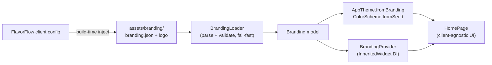

# FlavorFlow — Flutter white-label sample

The official **Flutter** reference implementation for [FlavorFlow](https://flavorflow.io):
a single, **100% client-agnostic** Flutter app that is re-branded for each of your
clients at **build time** — no `productFlavors`, no per-customer Dart files, no
flavor registry in the code.

It is the Flutter counterpart of the
[android-jetpack-compose-sample](https://github.com/FlavorFlow-io/android-jetpack-compose-sample)
and [android-xml-views-sample](https://github.com/FlavorFlow-io/android-xml-views-sample).

---

## 1. Overview

### What FlavorFlow is
FlavorFlow is a build-time white-labeling system. You define your **clients**
once — each with its own app name, package / bundle id, colors, and logo — and
FlavorFlow produces **one branded app per client** from a single codebase.

### Why this architecture differs from traditional Flutter flavors
The usual Flutter approach bakes every client into the app: Android
`productFlavors`, iOS targets/schemes, `main_customerA.dart` entry points, and a
big `switch` on the active flavor. Every new customer means **editing the app**.

FlavorFlow inverts that. The Flutter app is a **generic UI engine** that consumes
a generated branding artifact:

- A `branding.json` and a logo are injected into `assets/branding/` at build time.
- The app loads, validates, and themes itself from that artifact at startup.
- Native identity (applicationId / bundle id, launcher name, icons) is patched
  directly in the platform files.

### Why the app is client-agnostic
There is exactly **one** `main()`, **no** flavor enum, and **no** client names
anywhere in `lib/`. Adding a customer is purely a FlavorFlow configuration +
assets change — **zero** Flutter source edits. That property is enforced by the
contract and golden tests in this repo.

---

## 2. Prerequisites

| Tool | Version |
| ---- | ------- |
| Flutter SDK | 3.44+ (Dart 3.12+) |
| FlavorFlow | an account + project at [flavorflow.io](https://flavorflow.io) |
| Git | with submodule support (`git clone --recurse-submodules`) |

---

## 3. How to create a white-label app

> Steps (c)–(e) describe a real FlavorFlow integration. To try the app
> immediately without an account, skip to **[Run it locally](#run-it-locally)** —
> it ships with a default `branding.json` you can swap with the bundled fixtures.

**a. Get the project** — add it as a submodule of your build repo (or clone it):

```bash
git submodule add https://github.com/FlavorFlow-io/flavorflow-flutter-sample.git
# or:
git clone --recurse-submodules https://github.com/FlavorFlow-io/flavorflow-flutter-sample.git
```

**b. Install dependencies:**

```bash
flutter pub get
```

**c. Configure your clients on [flavorflow.io](https://flavorflow.io)** — create a
project and add a client for each brand (name, package / bundle id, colors, logo).

**d. Generate the branding artifact** — run FlavorFlow for a client to emit its
`branding.json` + logo into `assets/branding/`. (Locally you can simulate this
with a bundled fixture: `./scripts/apply-fixture.sh dark_brand`.)

**e. Patch the native platform files** — FlavorFlow rewrites the Android
`applicationId` + app name + launcher icons and the iOS bundle id + display name
+ `AppIcon`. See **[Native platform changes](#6-native-platform-changes)**.

**f. Build the branded app:**

```bash
flutter build apk      # Android
flutter build ipa      # iOS
```

**g. Or run it on a device/emulator:**

```bash
flutter run
```

<a name="run-it-locally"></a>
### Run it locally (no account needed)

```bash
flutter pub get
./scripts/apply-fixture.sh standard   # or: dark_brand | high_contrast
flutter run
```

---

## 4. Branding configuration reference

`assets/branding/branding.json` is the contract between FlavorFlow and this app.

| Field | Type | Required | Controls |
| ----- | ---- | -------- | -------- |
| `schemaVersion` | int | ✅ | Contract version. The app refuses a version newer than it understands (fail-fast). |
| `appName` | string | ✅ | Name shown **inside** the app (title bar / home). |
| `packageId` | string | ✅ | The application id / bundle id this build targets. Informational in-app; the real native values are patched separately. |
| `logo` | string | ✅ | Logo file name, relative to `assets/branding/`. |
| `tagline` | string | optional | Subtitle under the app name. Defaults to "Powered by FlavorFlow". |
| `colors.brightness` | `"light"` \| `"dark"` | ✅ | Light or dark Material theme. |
| `colors.seed` | hex | ✅ | Seed for `ColorScheme.fromSeed` — generates the full M3 palette. |
| `colors.primary` | hex | optional | Pins the primary role (else generated from the seed). |
| `colors.secondary` | hex | optional | Pins the secondary role. |
| `colors.tertiary` | hex | optional | Pins the tertiary role. |
| `colors.error` | hex | optional | Pins the error role. |

Colors accept `#RRGGBB` or `#AARRGGBB`. A complete example:

```json
{
  "schemaVersion": 1,
  "appName": "Standard Brand",
  "packageId": "io.flavorflow.sample.standard",
  "logo": "logo.png",
  "tagline": "The default FlavorFlow palette",
  "colors": {
    "brightness": "light",
    "seed": "#6750A4",
    "primary": "#6750A4",
    "secondary": "#625B71",
    "tertiary": "#7D5260",
    "error": "#B3261E"
  }
}
```

---

## 5. Project architecture

Branding flows one way — from FlavorFlow into a generic UI engine — at build time:



| Path | Responsibility |
| ---- | -------------- |
| `lib/main.dart` | Single entry point. No flavor switch. |
| `lib/app.dart` | Loads branding once; shows splash / **error screen** / themed app. |
| `lib/branding/branding_model.dart` | The contract schema + validation. |
| `lib/branding/branding_loader.dart` | Reads & validates `branding.json` (fail-fast). |
| `lib/branding/branding_provider.dart` | `InheritedWidget` DI — no external packages. |
| `lib/theme/app_theme.dart` | Builds Material 3 `ThemeData` from the model. |
| `lib/features/home/` | The single, brand-driven screen. |
| `assets/branding/` | Where FlavorFlow injects the artifact. |

**Fail-fast:** if `branding.json` is missing or malformed, the app shows a
descriptive error screen — it never silently falls back to default colors.

---

## 6. Native platform changes

The Flutter/Dart layer is **unaware** of native identity. FlavorFlow patches it
directly in the platform projects:

**Android**
- `applicationId` in `android/app/build.gradle(.kts)`.
- App name (`@string/app_name` / `android:label`) in `AndroidManifest.xml`.
- Launcher icons in `android/app/src/main/res/mipmap-*/`.

**iOS**
- `PRODUCT_BUNDLE_IDENTIFIER` in the Xcode project / build settings.
- `CFBundleDisplayName` in `ios/Runner/Info.plist`.
- `AppIcon` asset set in `ios/Runner/Assets.xcassets/`.

> The Flutter app does not read or depend on any of these values. Native
> branding and in-app branding are applied independently — the app simply boots
> and themes itself from `branding.json`.

---

## 7. Testing

This sample ships **contract tests** (every `branding.json` the backend can emit
must parse into a valid model) and **golden/screenshot tests** (every fixture
renders to a committed reference image). They exist so FlavorFlow changes can't
silently break the Flutter contract as the platform evolves — **you don't need
them for your own white-label app.** Run them with `flutter test`.

---

## 8. Adding a new customer

1. Add the client in FlavorFlow (name, package / bundle id, colors, logo).
2. Build — FlavorFlow injects that client's `branding.json` + logo and patches
   the native files.

That's it. **Zero Flutter code changes.** Only FlavorFlow configuration and
assets differ between customers — which is the whole point.
